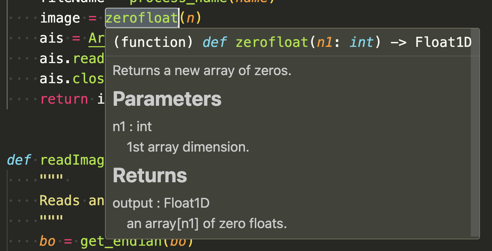

# JEXPI - JTK's Expansion and Python Interface

JEXPI is **J**TK's **Ex**pansion and **P**ython **I**nterface.


### Usage

```bash
# First, clone the source code
git clone https://github.com/JintaoLee-Roger/jexpi.git

# install via pip
pip install -e .
```


### Screen snapshots


##### VSCode

**Method**


**Static Method**



**Class**


##### Vim

**Method**


**Static Method**


**Class**


